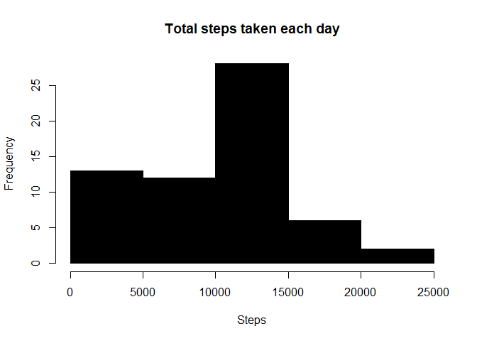
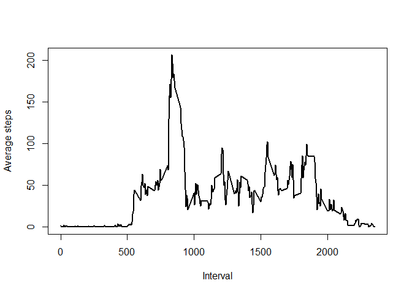
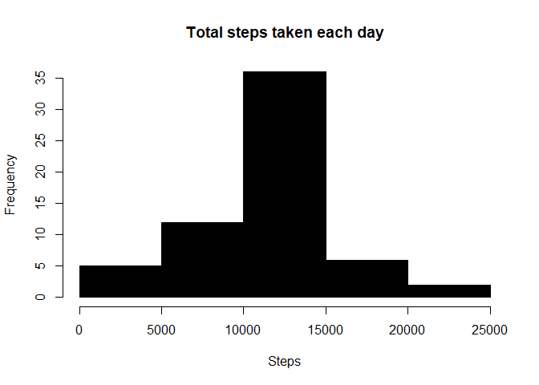
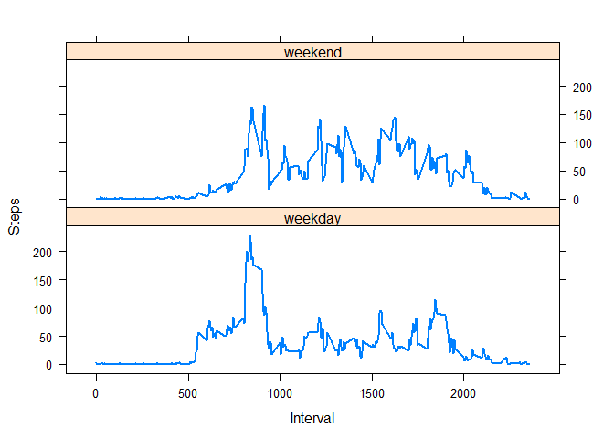

## Loading and preprocessing the data

1. Unzip the data
2. Load the data via "read.csv"
3. Create a new column that reflects the day of the week.


```r
unzip("activity.zip")

activity <- read.csv("activity.csv", sep = ",")

activity$date <- as.Date(activity$date)

weekday <- weekdays(activity$date)

activity <- cbind(activity, weekday)
```


## What is mean total number of steps taken per day?

The total steps taken per day is calculated by aggregating the steps by the date as shown below.
Note that entries with "NA" are taken out of the calculation


```r
totalStepsPerDay <- aggregate(activity$steps, by = list(activity$date), FUN = sum, na.rm = TRUE) 

names(totalStepsPerDay) = c("date", "totalSteps")
```


The histogram is given by:


```r
hist(totalStepsPerDay$totalSteps, main = "Total steps taken each day", col = "black",
                xlab = "Steps", breaks = 5)
```

<!-- -->


Here is the mean


```r
mean(totalStepsPerDay$totalSteps)
```

```
## [1] 9354.23
```


Here is the median


```r
median(totalStepsPerDay$totalSteps)
```

```
## [1] 10395
```


## What is the average daily activity pattern?

The average daily activity is plotted as follows:


```r
averageStepsPerDay <- aggregate(activity$steps, by = list(activity$interval), 
                FUN = mean, na.rm = TRUE) 

names(averageStepsPerDay) = c("interval", "averageSteps")

plot(averageStepsPerDay$interval, averageStepsPerDay$averageSteps, type = "l", lwd = 2,
                col = "black", xlab = "Interval", ylab = "Average steps")
```

<!-- -->


The interval with the highest average step is given by:


```r
averageStepsPerDay[which.max(averageStepsPerDay$averageSteps), ]$interval
```

```
## [1] 835
```


## Imputing missing values

The number of missing values can be calculated by:


```r
sum(is.na(activity$steps))
```

```
## [1] 2304
```


For simplicity, the missing values are going to be replaced by the average values for the given interval


```r
activityComplete <- activity

blank <- is.na(activityComplete$steps)

stepReplace <- tapply(activityComplete$steps, activityComplete$interval, 
                mean, na.rm=TRUE, simplify=TRUE)

activityComplete$steps[blank] <- stepReplace[as.character(activityComplete$interval[blank])]
```


Creating a histogram using the complete data set:


```r
totalStepsPerDay <- aggregate(activityComplete$steps, by = list(activityComplete$date), 
                FUN = sum, na.rm = TRUE) 

names(totalStepsPerDay) = c("date", "totalSteps")


hist(totalStepsPerDay$totalSteps, main = "Total steps taken each day", col = "black",
                xlab = "Steps", breaks = 5)
```

<!-- -->


Here is the new mean:


```r
mean(totalStepsPerDay$totalSteps)
```

```
## [1] 10766.19
```


Here is the new median:


```r
median(totalStepsPerDay$totalSteps)
```

```
## [1] 10766.19
```


The mean and the median increased compared to the earlier values


## Are there differences in activity patterns between weekdays and weekends?

For this one, we need to create a function to determine if the date is weekday or a weekend


```r
checkDayType <- function(x) {
        y <- weekdays(x)
        ifelse (y == "Saturday" | y == "Sunday", "weekend", "weekday")}

z <- sapply(activityComplete$date, checkDayType)

activityComplete$dayType <- as.factor(z)

activityCompleteWeekday <- aggregate(steps ~ dayType + interval, data = activityComplete, 
                FUN = mean)
```


The plot is given by


```r
library(lattice)

xyplot(steps ~ interval | factor(dayType), data = activityCompleteWeekday, 
                layout = c(1, 2), xlab = "Interval", ylab = "Steps", type = "l", lwd = 2)
```

<!-- -->


